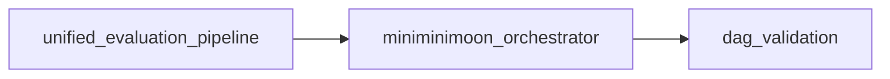

# Component Interaction Diagram

*Generated: 2025-10-05 11:01:35*

## System Overview

```mermaid
graph TB
    verify_reproducibility[verify_reproducibility] --> dag_validation[dag_validation]
    unified_evaluation_pipeline[unified_evaluation_pipeline] --> miniminimoon_orchestrator[miniminimoon_orchestrator]
    unified_evaluation_pipeline[unified_evaluation_pipeline] --> system_validators[system_validators]
    unified_evaluation_pipeline[unified_evaluation_pipeline] --> questionnaire_engine[questionnaire_engine]
    unified_evaluation_pipeline[unified_evaluation_pipeline] --> evidence_registry[evidence_registry]
    integration_example[integration_example] --> questionnaire_engine[questionnaire_engine]
    example_usage[example_usage] --> embedding_model[embedding_model]
    miniminimoon_orchestrator[miniminimoon_orchestrator] --> dag_validation[dag_validation]
    miniminimoon_orchestrator[miniminimoon_orchestrator] --> evidence_registry[evidence_registry]
    miniminimoon_orchestrator[miniminimoon_orchestrator] --> plan_processor[plan_processor]
    miniminimoon_orchestrator[miniminimoon_orchestrator] --> causal_pattern_detector[causal_pattern_detector]
    miniminimoon_orchestrator[miniminimoon_orchestrator] --> document_segmenter[document_segmenter]
    miniminimoon_orchestrator[miniminimoon_orchestrator] --> miniminimoon_immutability[miniminimoon_immutability]
    miniminimoon_orchestrator[miniminimoon_orchestrator] --> plan_sanitizer[plan_sanitizer]
    miniminimoon_orchestrator[miniminimoon_orchestrator] --> responsibility_detector[responsibility_detector]
    miniminimoon_orchestrator[miniminimoon_orchestrator] --> data_flow_contract[data_flow_contract]
    miniminimoon_orchestrator[miniminimoon_orchestrator] --> embedding_model[embedding_model]
    miniminimoon_orchestrator[miniminimoon_orchestrator] --> monetary_detector[monetary_detector]
    miniminimoon_orchestrator[miniminimoon_orchestrator] --> spacy_loader[spacy_loader]
    miniminimoon_orchestrator[miniminimoon_orchestrator] --> teoria_cambio[teoria_cambio]
    miniminimoon_orchestrator[miniminimoon_orchestrator] --> feasibility_scorer[feasibility_scorer]
    miniminimoon_orchestrator[miniminimoon_orchestrator] --> questionnaire_engine[questionnaire_engine]
    miniminimoon_orchestrator[miniminimoon_orchestrator] --> contradiction_detector[contradiction_detector]
    decalogo_pipeline_orchestrator[decalogo_pipeline_orchestrator] --> monetary_detector[monetary_detector]
    decalogo_pipeline_orchestrator[decalogo_pipeline_orchestrator] --> causal_pattern_detector[causal_pattern_detector]
    decalogo_pipeline_orchestrator[decalogo_pipeline_orchestrator] --> teoria_cambio[teoria_cambio]
    decalogo_pipeline_orchestrator[decalogo_pipeline_orchestrator] --> feasibility_scorer[feasibility_scorer]
    decalogo_pipeline_orchestrator[decalogo_pipeline_orchestrator] --> responsibility_detector[responsibility_detector]
    decalogo_pipeline_orchestrator[decalogo_pipeline_orchestrator] --> contradiction_detector[contradiction_detector]
    decalogo_pipeline_orchestrator[decalogo_pipeline_orchestrator] --> document_segmenter[document_segmenter]
```

## Critical Path Diagram

### Path 1

```mermaid
graph LR
    A[unified_evaluation_pipeline] -->     B[miniminimoon_orchestrator] -->     C[dag_validation]
```

### Path 2

```mermaid
graph LR
    A[decalogo_pipeline_orchestrator] -->     B[decalogo_loader] -->     C[system_validators]
```

### Path 3

```mermaid
graph LR
    A[embedding_model] -->     B[spacy_loader] -->     C[device_config]
```

### Path 4

```mermaid
graph LR
    A[questionnaire_engine] -->     B[evidence_registry] -->     C[system_validators]
```

### Path 5

```mermaid
graph LR
    A[plan_processor] -->     B[plan_sanitizer] -->     C[json_utils]
```

