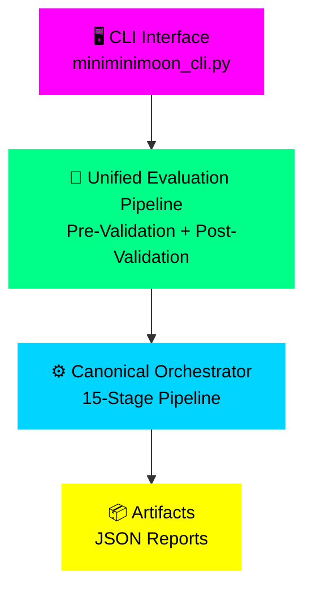
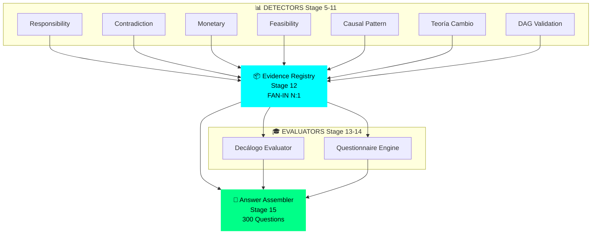
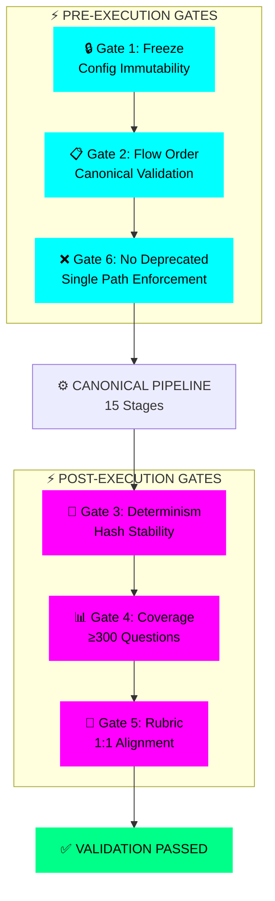
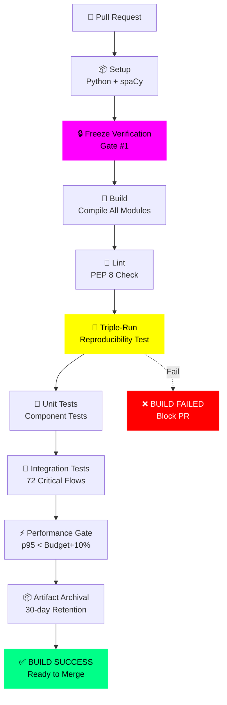
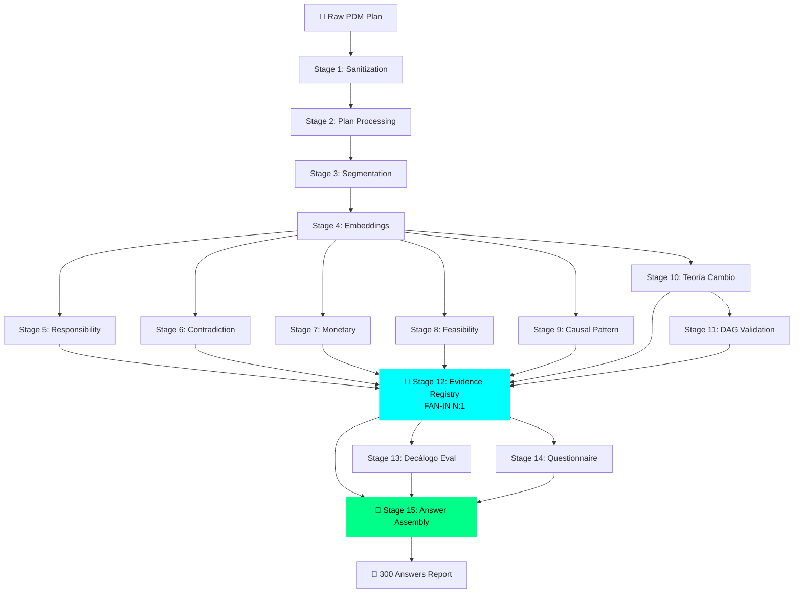
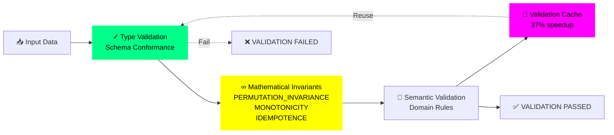
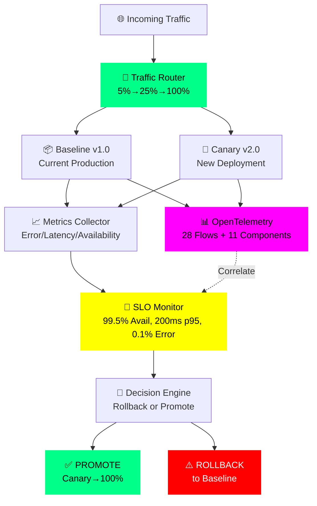

# MINIMINIMOON - Sistema Canónico de Evaluación de PDM

**Versión:** 2.0.0  
**Fecha:** 6 de octubre de 2025  
**Estado:** ✅ Verificado - Todos los flujos críticos operativos

---

## 📑 Tabla de Contenidos

1. [🎯 Descripción](#-descripción)
2. [📦 Instalación Completa (Paso a Paso)](#-instalación-completa-paso-a-paso)
   - [Requisitos Previos](#requisitos-previos)
   - [Instalación Manual (11 Pasos)](#paso-1-verificar-python-310)
   - [Instalación Automatizada](#instalación-automatizada-script)
3. [🚀 Guía de Implementación (Workflow Completo)](#-guía-de-implementación-workflow-completo)
   - [Paso 1: Congelar Configuración (Gate #1)](#paso-1-congelar-configuración-gate-1---obligatorio)
   - [Paso 2: Verificar Estado](#paso-2-verificar-estado-del-sistema-pre-ejecución)
   - [Paso 3: Primera Evaluación](#paso-3-ejecutar-primera-evaluación-de-pdm)
   - [Paso 4: Inspeccionar Resultados](#paso-4-inspeccionar-resultados)
   - [Paso 5: Verificar Reproducibilidad](#paso-5-verificar-reproducibilidad-gate-3---crítico)
   - [Paso 6: Validar Rúbrica](#paso-6-validar-alineación-de-rúbrica-gate-5)
   - [Paso 7: Matriz de Trazabilidad](#paso-7-generar-matriz-de-trazabilidad)
   - [Paso 8: Verificación Completa](#paso-8-verificación-post-ejecución-completa)
4. [🔧 Uso Programático (API Python)](#-uso-programático-api-python)
5. [🆘 Troubleshooting](#-troubleshooting-solución-de-problemas)
6. [🏗️ Arquitectura del Sistema](#️-arquitectura-del-sistema)
7. [🛡️ Gates de Aceptación](#️-gates-de-aceptación-verificación-automática)
8. [📁 Archivos Fundamentales](#-archivos-fundamentales-del-sistema)
9. [📊 Salidas del Sistema](#-salidas-del-sistema)
10. [📊 Visual Architecture Diagrams](#-visual-architecture-diagrams)
11. [🧪 Testing y Verificación](#-testing-y-verificación)
12. [🤝 Contribución](#-contribución)
13. [📚 Documentación Adicional](#-documentación-adicional)
14. [⚡ Quick Reference (Comandos Comunes)](#-quick-reference-comandos-comunes)

---

## 🎯 Descripción

Sistema de evaluación determinista y reproducible de Planes de Desarrollo Municipal (PDM) basado en:
- **300 preguntas** estructuradas en 10 puntos temáticos × 30 preguntas
- **Flujo canónico único** con 72 flujos críticos verificados
- **6 gates de aceptación** obligatorios para garantizar calidad
- **Evidence Registry único** (single source of truth)
- **Trazabilidad completa** desde evidencia hasta respuesta final

---

## 🏗️ Arquitectura del Sistema

> **📊 Visual Architecture**: See [complete visual documentation](#-visual-architecture-diagrams) with 7 advanced diagrams depicting system flow, validation gates, and deployment infrastructure.

### Orquestador Principal (Entry Point Único)

```python
from miniminimoon_orchestrator import CanonicalDeterministicOrchestrator

orchestrator = CanonicalDeterministicOrchestrator(
    config_dir=".",
    enable_validation=True,
    flow_doc_path="tools/flow_doc.json"
)

results = orchestrator.process_plan_deterministic(plan_path)
```

### 🔄 Pipeline Canónico (15 Etapas Secuenciales)

#### **Fase 1: Procesamiento (Etapas 1-11)**

1. **Sanitización** (`plan_sanitizer`)
   - Input: `{raw_text: str}`
   - Output: `{sanitized_text: str}`
   - Normalización determinista del texto

2. **Procesamiento de Plan** (`plan_processor`)
   - Input: `{sanitized_text: str}`
   - Output: `{doc_struct: dict}`
   - Estructura estable para trazabilidad

3. **Segmentación** (`document_segmenter`)
   - Input: `{doc_struct: dict}`
   - Output: `{segments: list[dict]}`
   - Granularidad por pregunta con IDs deterministas

4. **Embeddings** (`embedding_model`)
   - Input: `{segments: list}`
   - Output: `{embeddings: list}`
   - Búsqueda semántica reproducible (seed fija)

5. **Detección de Responsabilidades** (`responsibility_detector`)
   - Input: `{segments: list}`
   - Output: `{responsibilities: list[dict]}`
   - Mapea responsables a preguntas DE-1/DE-3

6. **Detección de Contradicciones** (`contradiction_detector`)
   - Input: `{segments: list}`
   - Output: `{contradictions: list[dict]}`
   - Consistencia y penalizaciones de rubro

7. **Detección Monetaria** (`monetary_detector`)
   - Input: `{segments: list}`
   - Output: `{monetary: list[dict]}`
   - Costos/metas financieras

8. **Scoring de Factibilidad** (`feasibility_scorer`)
   - Input: `{segments: list}`
   - Output: `{feasibility: dict}`
   - Presencia de líneas base/objetivos/metas

9. **Patrones Causales** (`causal_pattern_detector`)
   - Input: `{segments: list}`
   - Output: `{causal_patterns: dict}`
   - Soporte causal para respuestas explicativas

10. **Teoría del Cambio** (`teoria_cambio`)
    - Input: `{segments: list}`
    - Output: `{toc_graph: dict, industrial_validation: dict}`
    - Coherencia medios-fines + reporte industrial completo

11. **Validación DAG** (`dag_validation`)
    - Input: `{toc_graph: dict}`
    - Output: `{dag_diagnostics: dict}`
    - Validez estructural (DAG) verificable

#### **Fase 2: Construcción de Evidencia (Etapa 12)**

1. **Evidence Registry** (Fan-in N:1)
    - Input: Outputs de etapas 5-11
    - Output: `{evidence_hash: str, evidence_store: dict}`
    - **Único origen de verdad** para evaluadores
    - Provenance completo + hash determinista

#### **Fase 3: Evaluación (Etapas 13-14)**

1. **Evaluación Decálogo** (`Decatalogo_principal`)
    - Input: `{evidence_store}`
    - Output: `{decalogo_eval: dict}`
    - Evaluación data-driven por dimensión/pregunta

2. **Evaluación Cuestionario** (`questionnaire_engine`)
    - Input: `{evidence_store}`
    - Output: `{questionnaire_eval: dict}`
    - 300 preguntas sobre la misma evidencia

#### **Fase 4: Ensamblaje Final (Etapa 15)**

1. **Answer Assembler** (`answer_assembler`)
    - Input: `{evidence_store, rubric, decalogo_eval, questionnaire_eval}`
    - Output: `{answers_report: dict}`
    - Respuestas con evidence_ids, confidence, score y rationale

---

## 🛡️ Gates de Aceptación (Verificación Automática)

### Gate #1: Configuración Inmutable ✅
```bash
python miniminimoon_cli.py freeze
```
- Verifica: `verify_frozen_config() == True`
- Crea snapshot SHA-256 de configuraciones críticas
- **Bloqueo:** Pipeline no ejecuta sin snapshot válido

### Gate #2: Validación de Flujo ✅
- Compara: `flow_runtime.json` vs `tools/flow_doc.json`
- Verifica: Orden canónico + contratos I/O
- **Bloqueo:** Falla si orden o contratos divergen

### Gate #3: Hash de Evidencia Determinista ✅
- Verifica: `evidence_hash` estable con mismo input
- **Bloqueo:** Triple-run debe producir mismo hash

### Gate #4: Cobertura Completa ✅
- Verifica: `answers_report.summary.total_questions ≥ 300`
- **Bloqueo:** Falla si no se responden las 300 preguntas

### Gate #5: Alineación de Rúbrica ✅
```bash
python miniminimoon_cli.py rubric-check
```
- Verifica: 1:1 preguntas ↔ pesos (sin missing/extra)
- **Bloqueo:** Exit code 3 si hay desalineación

### Gate #6: No Deprecated Orchestrator ✅
- Verifica: `decalogo_pipeline_orchestrator` NO usado
- **Bloqueo:** RuntimeError al importar módulo deprecado

---

## 📁 Archivos Fundamentales del Sistema

### 1. Configuración (3 archivos obligatorios)

```
decalogo_industrial.json          # ÚNICO DECÁLOGO (cuestionario 300 preguntas)
dnp-standards.latest.clean.json   # Estándares DNP
RUBRIC_SCORING.json                # Sistema de scoring y pesos
```

### 2. Código Core

```
miniminimoon_orchestrator.py      # Orquestador canónico (ÚNICO punto de entrada)
unified_evaluation_pipeline.py    # Fachada unificada con pre/post validation
answer_assembler.py                # Ensamblador de respuestas finales
evidence_registry.py               # Registro único de evidencia
system_validators.py               # Validadores pre/post ejecución
```

### 3. Componentes del Pipeline (11 módulos)

```
plan_sanitizer.py                  # Etapa 1: Sanitización
plan_processor.py                  # Etapa 2: Procesamiento
document_segmenter.py              # Etapa 3: Segmentación
embedding_model.py                 # Etapa 4: Embeddings
responsibility_detector.py         # Etapa 5: Responsabilidades
contradiction_detector.py          # Etapa 6: Contradicciones
monetary_detector.py               # Etapa 7: Detección monetaria
feasibility_scorer.py              # Etapa 8: Factibilidad
causal_pattern_detector.py        # Etapa 9: Patrones causales
teoria_cambio.py                   # Etapa 10: Teoría del cambio
dag_validation.py                  # Etapa 11: Validación DAG
```

### 4. Evaluadores

```
Decatalogo_principal.py            # Evaluador por dimensiones
questionnaire_engine.py            # Motor de 300 preguntas
```

### 5. Herramientas de Verificación

```
miniminimoon_cli.py                # CLI: freeze, evaluate, verify, rubric-check, trace-matrix
system_validators.py               # Validadores pre/post ejecución
test_validation_end_to_end.py      # Verificación end-to-end
tools/flow_doc.json                # Orden canónico documentado
determinism_guard.py               # Fijación de seeds deterministas
```

### 6. Documentación

```
DEPRECATIONS.md                    # Módulos deprecados y migración
FLUJOS_CRITICOS_GARANTIZADOS.md   # 72 flujos críticos detallados
ARCHITECTURE.md                    # Arquitectura del sistema
DEPLOYMENT_INFRASTRUCTURE.md       # Infraestructura de deployment
```

---

## 📦 Instalación Completa (Paso a Paso)

> **🚀 NEW: Automated Installation**
> 
> We now provide an automated installation script with dependency verification:
> ```bash
> bash scripts/install_verified.sh
> ```
> This script handles Python version checking, dependency installation, and verification automatically.
>
> For manual installation or troubleshooting, see the detailed steps below.

### Quick Start (Automated Installation)

The fastest way to get started is using our verified installation script:

```bash
# 1. Clone the repository
git clone https://github.com/ANITALAVALATINACONPRISA/SIN_CARRETA.git
cd SIN_CARRETA

# 2. Run automated installation
bash scripts/install_verified.sh
```

The script will:
- ✅ Verify Python version (3.10-3.12)
- ✅ Prompt for CPU or GPU PyTorch installation
- ✅ Install all core dependencies
- ✅ Download spaCy language models
- ✅ Run conflict detection
- ✅ Generate compatibility certificate
- ✅ Verify critical imports

### System Requirements

**Python Version:**
- **Python 3.10, 3.11, or 3.12** (REQUIRED)
- Other versions are NOT supported due to:
  - NumPy >=1.21.0 compatibility (first version with Python 3.10 wheels)
  - Modern type hints and pattern matching features
  - Tested dependency combinations

**Operating System:**
- Linux (Ubuntu 18.04+, Debian 10+)
- macOS (10.15+, including Apple Silicon)
- Windows 10+ (WSL2 recommended)

**Hardware:**
- **Disk Space:** 5-10 GB (includes ML models and cache)
- **RAM:** 8 GB minimum, 16 GB recommended for large documents
- **GPU:** Optional, CUDA 11.8 or 12.1 for GPU acceleration

### Installation Options

#### Option 1: Automated Installation (Recommended)

Use the interactive installation script:

```bash
# Navigate to repository
cd SIN_CARRETA

# Run installation script
bash scripts/install_verified.sh

# Follow the prompts to select:
# - PyTorch variant (CPU or CUDA)
# - Optional dependencies (dev, prod, security)
```

#### Option 2: Manual Installation with Requirements Structure

For more control, use the new structured requirements:

```bash
# 1. Create virtual environment with Python 3.10-3.12
python3.10 -m venv venv
source venv/bin/activate  # On Windows: venv\Scripts\activate

# 2. Upgrade pip
python -m pip install --upgrade pip

# 3. Choose your installation variant:

# For CPU-only (development, CI/CD):
pip install -r requirements/torch-cpu.txt --extra-index-url https://download.pytorch.org/whl/cpu

# For CUDA 11.8 (NVIDIA GPU):
pip install -r requirements/torch-cuda.txt --extra-index-url https://download.pytorch.org/whl/cu118

# For CUDA 12.1 (NVIDIA GPU):
pip install -r requirements/torch-cuda.txt --extra-index-url https://download.pytorch.org/whl/cu121

# 4. Install spaCy models
python -m spacy download es_core_news_sm

# 5. Verify installation
python scripts/validate_continuous.py
```

#### Option 3: Development Installation

For contributors and developers:

```bash
# Install with development dependencies
pip install -r requirements/dev.txt --extra-index-url https://download.pytorch.org/whl/cpu

# Install pre-commit hooks
pre-commit install

# Run full validation
python scripts/validate_continuous.py --all
```

#### Option 4: Production Installation

For production deployments:

```bash
# Install with production dependencies (GPU)
pip install -r requirements/prod.txt --extra-index-url https://download.pytorch.org/whl/cu118

# Verify no conflicts
python scripts/check_conflicts.py

# Generate compatibility certificate
python scripts/generate_certificate.py
```

### Dependency Management Tools

The system now includes industrial-grade dependency management:

**1. Python Version Enforcement**
```bash
# Check Python version compatibility
python scripts/check_python_version.py
```

**2. Import Analysis**
```bash
# Analyze all Python imports in the codebase
python scripts/analyze_imports.py --output import_analysis.json
```

**3. Conflict Detection**
```bash
# Check for dependency conflicts and version issues
python scripts/check_conflicts.py
```

**4. Compatibility Certificate**
```bash
# Generate cryptographic proof of system compatibility
python scripts/generate_certificate.py
# Creates: certificates/compatibility_certificate.{json,md}
```

**5. Continuous Validation**
```bash
# Run all validation checks (for pre-commit/CI)
python scripts/validate_continuous.py --all
```

### Requirements File Structure

The system uses a modular requirements structure:

```
requirements/
├── base.txt          # Core dependencies (always required)
├── torch-cpu.txt     # CPU-only PyTorch (dev/CI)
├── torch-cuda.txt    # GPU PyTorch (production)
├── dev.txt           # Development tools (pytest, mypy, black)
├── test.txt          # Testing dependencies only
├── prod.txt          # Production deployment (FastAPI, Celery)
└── security.txt      # Security scanning tools
```

### Verification Steps

After installation, verify your setup:

```bash
# 1. Check Python version
python scripts/check_python_version.py

# 2. Verify critical imports
python -c "import numpy, torch, transformers, spacy; print('✓ All critical imports OK')"

# 3. Check for conflicts
python scripts/check_conflicts.py

# 4. Run validation suite
python scripts/validate_continuous.py

# 5. Generate certificate (optional)
python scripts/generate_certificate.py
```

### Troubleshooting

**Python Version Issues:**
```bash
# Check current version
python --version

# If wrong version, use pyenv:
pyenv install 3.10.13
pyenv local 3.10.13

# Or use conda:
conda create -n miniminimoon python=3.10
conda activate miniminimoon
```

**Dependency Conflicts:**
```bash
# Check for conflicts
python scripts/check_conflicts.py

# If conflicts found, reinstall with pinned versions:
pip install --force-reinstall -r requirements/torch-cpu.txt
```

**Import Errors:**
```bash
# Analyze imports to find issues
python scripts/analyze_imports.py

# Check specific module
python -c "import <module_name>; print(<module_name>.__version__)"
```

**CUDA Issues:**
```bash
# Check CUDA availability
python -c "import torch; print('CUDA available:', torch.cuda.is_available())"

# Verify CUDA version
python -c "import torch; print('CUDA version:', torch.version.cuda)"
```

### Legacy Installation (Backward Compatible)

The legacy installation method using `requirements.txt` is still supported:

### Legacy Installation (Backward Compatible)

The legacy installation method using `requirements.txt` is still supported:

#### Requisitos Previos

**Sistema Operativo:**
- Linux (Ubuntu 18.04+, Debian 10+)
- macOS (10.15+, incluye Apple Silicon)
- Windows 10+ (con WSL2 recomendado)

**Python Version:**
- **Python 3.10** (REQUERIDO - versión exacta)
- Otras versiones NO soportadas debido a compatibilidad con NumPy >=1.21.0 y modelos de embeddings

**Espacio en Disco:**
- Mínimo: 5 GB
- Recomendado: 10 GB (incluye modelos de NLP y caché)

**Memoria RAM:**
- Mínimo: 8 GB
- Recomendado: 16 GB (para planes grandes >100 páginas)

### Paso 1: Verificar Python 3.10

```bash
# Verificar versión de Python
python3.10 --version

# Si no está instalado:
# Ubuntu/Debian:
sudo apt update
sudo apt install python3.10 python3.10-venv python3.10-dev

# macOS (con Homebrew):
brew install python@3.10

# Verificar que esté disponible
which python3.10
```

### Paso 2: Clonar el Repositorio

```bash
# Clonar repositorio
git clone https://github.com/ANITALAVALATINACONPRISA/SIN_CARRETA.git
cd SIN_CARRETA

# Verificar que estás en el directorio correcto
pwd  # Debe mostrar: /ruta/a/SIN_CARRETA
ls   # Debe mostrar: README.md, requirements.txt, miniminimoon_orchestrator.py, etc.
```

### Paso 3: Crear Entorno Virtual (Python 3.10)

```bash
# Crear entorno virtual con Python 3.10
python3.10 -m venv venv

# Activar entorno virtual
# En Linux/macOS:
source venv/bin/activate

# En Windows (PowerShell):
# .\venv\Scripts\Activate.ps1

# Verificar que Python 3.10 está activo
python --version  # Debe mostrar: Python 3.10.x
```

### Paso 4: Actualizar pip, setuptools y wheel

```bash
# Actualizar herramientas de instalación
python -m pip install --upgrade pip setuptools wheel

# Verificar versiones actualizadas
pip --version  # Debe mostrar pip 23.0 o superior
```

### Paso 5: Instalar Dependencias Base

```bash
# Instalar todas las dependencias del proyecto
pip install -r requirements.txt

# Tiempo estimado: 5-10 minutos
# Si encuentras errores, ver sección de Troubleshooting abajo
```

### Paso 6: Instalar Dependencias de Desarrollo (Opcional)

```bash
# Solo si necesitas ejecutar tests o desarrollo
pip install -r requirements-dev.txt

# Incluye: pytest, mypy, black, flake8, pylint
```

### Paso 7: Descargar Modelos de NLP

```bash
# Descargar modelos de spaCy (español)
python -m spacy download es_core_news_sm
python -m spacy download es_core_news_md

# Descargar datos de NLTK
python -c "import nltk; nltk.download('punkt'); nltk.download('stopwords'); nltk.download('wordnet'); nltk.download('averaged_perceptron_tagger')"

# Verificar instalación de modelos
python -c "import spacy; nlp = spacy.load('es_core_news_sm'); print('✓ spaCy modelo cargado correctamente')"
```

### Paso 8: Crear Estructura de Directorios

```bash
# Crear directorios necesarios para el sistema
mkdir -p artifacts config logs output data

# Verificar estructura
ls -la | grep -E "artifacts|config|logs|output|data"
```

### Paso 9: Verificar Archivos de Configuración

```bash
# Verificar que existan los archivos de configuración críticos
ls -la config/ | grep -E "decalogo_industrial|dnp-standards|RUBRIC_SCORING"

# O verificar en el directorio raíz:
ls -la | grep -E "decalogo_industrial|dnp-standards|RUBRIC_SCORING"

# Archivos requeridos:
# - decalogo_industrial.json (o decalogo-industrial.latest.clean.json)
# - dnp-standards.latest.clean.json
# - RUBRIC_SCORING.json (o rubric_scoring.json)
```

**⚠️ Si faltan archivos:** El sistema no podrá ejecutarse sin estos archivos. Deben ser proporcionados por el administrador del proyecto.

### Paso 10: Ejecutar Verificación de Compatibilidad

```bash
# Verificar que todo está correctamente instalado
python python_310_compatibility_checker.py

# Output esperado:
# ✓ Python 3.10.x detected
# ✓ NumPy version compatible
# ✓ All dependencies installed
# ✓ System ready for operation
```

### Paso 11: Verificar Instalación del Sistema

```bash
# Verificar que todos los módulos se pueden importar
python -c "from miniminimoon_orchestrator import CanonicalDeterministicOrchestrator; print('✓ Orchestrator OK')"
python -c "from plan_processor import PlanProcessor; print('✓ Plan Processor OK')"
python -c "from document_segmenter import DocumentSegmenter; print('✓ Document Segmenter OK')"
python -c "from plan_sanitizer import PlanSanitizer; print('✓ Plan Sanitizer OK')"
python -c "from embedding_model import EmbeddingModel; print('✓ Embedding Model OK')"

# Si todos muestran "✓ ... OK", la instalación fue exitosa
```

### Instalación Automatizada (Script)

Si prefieres una instalación automatizada, puedes usar el script `setup_environment.sh`:

```bash
# Hacer ejecutable el script
chmod +x setup_environment.sh

# Ejecutar script de instalación
./setup_environment.sh
```

**El script automatiza:**
- ✓ Verificación de Python 3.10
- ✓ Creación de entorno virtual
- ✓ Instalación de dependencias (base + dev opcional)
- ✓ Descarga de modelos NLP (spaCy + NLTK)
- ✓ Creación de estructura de directorios
- ✓ Verificación de archivos de configuración
- ✓ Tests básicos de verificación (opcional)

**Interacción durante el script:**

```bash
# El script preguntará:
¿Deseas instalar dependencias de desarrollo? (y/n): y
¿Deseas ejecutar tests básicos de verificación? (y/n): y
```

**Output esperado al finalizar:**

```
==========================================
Setup completado exitosamente!
==========================================

Para activar el entorno en el futuro:
  source venv/bin/activate

Para ejecutar el sistema:
  1. Congelar configuración:
     python miniminimoon_orchestrator.py freeze ./config/

  2. Ejecutar evaluación:
     python miniminimoon_orchestrator.py evaluate ./config/ plan.pdf ./output/

  3. Verificar reproducibilidad:
     python miniminimoon_orchestrator.py verify ./config/ plan.pdf --runs 3

Documentación completa en:
  - FLUJOS_CRITICOS_GARANTIZADOS.md
  - ARCHITECTURE.md
```

**⚠️ Nota para Windows:** El script `setup_environment.sh` es para Linux/macOS. Para Windows, usa `setup_environment.bat` o sigue los pasos manuales en PowerShell.

---

## 🚀 Guía de Implementación (Workflow Completo)

Una vez completada la instalación, sigue estos pasos para implementar y usar el sistema:

### Paso 1: Congelar Configuración (Gate #1) - OBLIGATORIO

Este paso es **CRÍTICO** y debe ejecutarse antes de cualquier evaluación.

```bash
# Activar entorno virtual si no está activo
source venv/bin/activate

# Congelar configuración (crea snapshot inmutable)
python miniminimoon_cli.py freeze

# O usando el orquestador directamente:
python miniminimoon_orchestrator.py freeze ./config/
```

**¿Qué hace esto?**
- Crea `.immutability_snapshot.json` con hash SHA-256 de todos los archivos de configuración
- Garantiza que la configuración no cambie entre ejecuciones
- Es requisito obligatorio para Gate #1 (primera validación)

**Output esperado:**
```
✓ Configuration frozen successfully
  Hash: a3f8d2e1b4c5a9f2d8e6c4a1b7f3d9e5
  Files: ['decalogo_industrial.json', 'dnp-standards.latest.clean.json', 'RUBRIC_SCORING.json']
  Snapshot saved: .immutability_snapshot.json
```

### Paso 2: Verificar Estado del Sistema (Pre-Ejecución)

```bash
# Verificar sistema con validación end-to-end
python test_validation_end_to_end.py

# O verificar usando el CLI con diagnóstico
python miniminimoon_cli.py diagnostic

# O verificar que el sistema está operativo
python -c "from system_validators import SystemHealthValidator; print('✓ System validators ready')"
```

### Paso 3: Ejecutar Primera Evaluación de PDM

```bash
# Evaluación completa con validación estricta
python miniminimoon_cli.py evaluate --plan path/to/tu_plan.pdf --strict

# O usando el orquestador con más control:
python miniminimoon_orchestrator.py evaluate ./config/ tu_plan.pdf ./output/

# Tiempo estimado: 45-60 segundos para plan de ~50 páginas
```

**Argumentos:**
- `--plan`: Ruta al archivo PDF del Plan de Desarrollo Municipal
- `--strict`: Modo estricto (activa todas las validaciones)
- `./config/`: Directorio con archivos de configuración
- `./output/`: Directorio donde se guardarán los resultados

**Artifacts Generados (en `output/` o `artifacts/`):**

```
output/
├── answers_report.json           # ⭐ Reporte completo con 300 preguntas respondidas
├── answers_sample.json           # Muestra de las primeras 10 respuestas
├── evidence_registry.json        # Registro único de toda la evidencia recolectada
├── flow_runtime.json             # Trace completo de ejecución (orden + contratos I/O)
├── coverage_report.json          # Cobertura: qué preguntas tienen evidencia
├── final_results.json            # Resultados consolidados + hashes (evidence_hash, flow_hash)
└── module_to_questions_matrix.csv # Matriz de trazabilidad: módulo → pregunta → evidencia
```

### Paso 4: Inspeccionar Resultados

```bash
# Ver resumen de resultados
cat output/final_results.json | python -m json.tool | head -50

# Ver muestra de respuestas
cat output/answers_sample.json | python -m json.tool

# Ver evidencia recolectada
cat output/evidence_registry.json | python -m json.tool | head -100

# Verificar cobertura de preguntas
python -c "import json; data=json.load(open('output/coverage_report.json')); print(f'Preguntas respondidas: {data[\"coverage_summary\"][\"total_answered\"]}/300')"
```

**Estructura de una Respuesta (ejemplo):**

```json
{
  "question_id": "DE-1-Q4",
  "dimension": "DE-1",
  "question_text": "¿Se especifican líneas base cuantitativas?",
  "evidence_ids": ["resp_abc123", "feas_def456"],
  "confidence": 0.85,
  "score": 2.5,
  "reasoning": "Evidencia sólida de líneas base en 3 programas: Educación (45% cobertura 2023), Salud (62% atención 2023), Infraestructura (78% vías pavimentadas 2023)...",
  "rubric_weight": 0.15,
  "supporting_quotes": [
    "Línea base 2023: 45% cobertura educativa en zona rural",
    "Meta 2027: Incrementar a 75% cobertura educativa"
  ],
  "caveats": ["Basado en 2 fuentes de evidencia", "No se encontró línea base para programa de medio ambiente"]
}
```

### Paso 5: Verificar Reproducibilidad (Gate #3) - CRÍTICO

Este paso valida que el sistema es **determinista**: mismo input = mismo output.

```bash
# Ejecutar pipeline 3 veces con el mismo input
python miniminimoon_orchestrator.py verify ./config/ tu_plan.pdf --runs 3

# O manualmente:
for i in {1..3}; do
  python miniminimoon_cli.py evaluate --plan tu_plan.pdf --output run_${i}.json
done

# Comparar hashes (deben ser IDÉNTICOS)
python -c "
import json
hashes = []
for i in range(1, 4):
    with open(f'run_{i}.json') as f:
        data = json.load(f)
        hashes.append(data['evidence_hash'])
print('Evidence hashes:', hashes)
print('Todas idénticas:', len(set(hashes)) == 1)
"
```

**Output esperado:**
```
✓ Run 1 completed - evidence_hash: a3f8d2e1b4c5...
✓ Run 2 completed - evidence_hash: a3f8d2e1b4c5...
✓ Run 3 completed - evidence_hash: a3f8d2e1b4c5...
✓ DETERMINISM VERIFIED: All hashes identical
✓ Gate #3 PASSED
```

**⚠️ Si los hashes NO son idénticos:** Hay un problema de no-determinismo. Reportar como bug.

### Paso 6: Validar Alineación de Rúbrica (Gate #5)

```bash
# Verificar que hay correspondencia 1:1 entre preguntas y pesos de rúbrica
python miniminimoon_cli.py rubric-check \
    output/answers_report.json \
    config/RUBRIC_SCORING.json
```

**Output esperado (PASSING):**
```
================================================================================
RUBRIC VALIDATION REPORT
================================================================================
✓ Total questions in answers_report: 300
✓ Total weights in rubric: 300
✓ All questions have corresponding weights
✓ All weights have corresponding questions
✓ No missing questions
✓ No extra weights
================================================================================
✓ RUBRIC VALIDATION PASSED - Gate #5 ✓
================================================================================
```

**Output esperado (FAILING):**
```
================================================================================
RUBRIC VALIDATION REPORT
================================================================================
✗ Total questions in answers_report: 300
✗ Total weights in rubric: 295
✗ MISSING questions (no weight): ['DE-3-Q14', 'DE-5-Q22', ...]
✗ EXTRA weights (no question): []
================================================================================
✗ RUBRIC VALIDATION FAILED - Gate #5 ✗
Exit code: 3
================================================================================
```

**Si falla:** Corregir `RUBRIC_SCORING.json` para añadir/eliminar pesos según sea necesario.

### Paso 7: Generar Matriz de Trazabilidad

```bash
# Generar matriz completa: módulo → pregunta → evidencia
python miniminimoon_cli.py trace-matrix

# Output: artifacts/module_to_questions_matrix.csv
```

Este archivo CSV muestra qué módulos del pipeline generaron evidencia para qué preguntas, permitiendo auditoría completa.

### Paso 8: Verificación Post-Ejecución Completa

```bash
# Ejecutar todas las verificaciones post-ejecución
python miniminimoon_cli.py verify

# Este comando ejecuta:
# - Verificación de Gates #3, #4, #5
# - Validación de contratos I/O
# - Verificación de orden canónico
# - Chequeo de cobertura ≥300 preguntas
```

---

## 🔧 Uso Programático (API Python)

Para integrar MINIMINIMOON en tu propio código:

```python
from miniminimoon_orchestrator import CanonicalDeterministicOrchestrator

# Inicializar orquestador con validación habilitada
orchestrator = CanonicalDeterministicOrchestrator(
    config_dir="./config",           # Directorio con archivos JSON
    enable_validation=True,           # Activar validación de gates
    flow_doc_path="tools/flow_doc.json",  # Orden canónico documentado
    log_level="INFO"                  # DEBUG, INFO, WARNING, ERROR
)

# Ejecutar pipeline completo de forma determinista
results = orchestrator.process_plan_deterministic("path/to/plan.pdf")

# Acceder a resultados
print(f"Evidence hash: {results['evidence_hash']}")
print(f"Flow hash: {results['validation']['flow_hash']}")
print(f"Total preguntas: {results['evaluations']['answers_report']['summary']['total_questions']}")

# Acceder a respuestas individuales
answers = results['evaluations']['answers_report']['answers']
for answer in answers[:5]:  # Primeras 5 respuestas
    print(f"Q: {answer['question_id']} - Score: {answer['score']}")

# Acceder a evidencia
evidence_store = results['evidence_registry']
print(f"Total evidencias: {len(evidence_store['evidence_by_type'])}")

# Guardar resultados
import json
with open('my_results.json', 'w', encoding='utf-8') as f:
    json.dump(results, f, indent=2, ensure_ascii=False)
```

---

## 🆘 Troubleshooting (Solución de Problemas)

### Problema 1: Error al instalar dependencias

**Síntoma:**
```
ERROR: Could not find a version that satisfies the requirement...
```

**Soluciones:**

```bash
# Solución 1: Verificar versión de Python
python --version  # DEBE ser 3.10.x

# Solución 2: Limpiar caché de pip
pip cache purge
pip install -r requirements.txt --no-cache-dir

# Solución 3: Instalar en grupos pequeños
pip install numpy scipy scikit-learn
pip install pandas
pip install torch --index-url https://download.pytorch.org/whl/cpu  # CPU-only (más ligero)
pip install sentence-transformers
pip install spacy networkx matplotlib
```

### Problema 2: Error "No space left on device"

**Síntoma:**
```
[Errno 28] No space left on device
```

**Soluciones:**

```bash
# Ver espacio disponible
df -h

# Limpiar caché de pip
pip cache purge

# Instalar torch CPU-only (más ligero: ~200MB vs ~2GB)
pip uninstall torch
pip install torch --index-url https://download.pytorch.org/whl/cpu

# Ver espacio usado por venv
du -sh venv/

# Si necesario, mover a disco con más espacio
mv venv /otro/disco/con/espacio/
ln -s /otro/disco/con/espacio/venv venv
```

### Problema 3: Error al importar módulos

**Síntoma:**
```
ImportError: cannot import name 'CanonicalDeterministicOrchestrator'
ModuleNotFoundError: No module named 'plan_processor'
```

**Soluciones:**

```bash
# Verificar que estás en el directorio correcto
pwd  # Debe mostrar: /ruta/a/SIN_CARRETA

# Verificar que el entorno virtual está activo
which python  # Debe mostrar: /ruta/a/SIN_CARRETA/venv/bin/python

# Reinstalar dependencias
pip install -r requirements.txt --force-reinstall

# Verificar archivos Python existen
ls -la *.py | grep -E "orchestrator|processor|segmenter|sanitizer"
```

### Problema 4: Error "No frozen config snapshot"

**Síntoma:**
```
RuntimeError: Configuration must be frozen before execution (Gate #1)
File not found: .immutability_snapshot.json
```

**Solución:**

```bash
# Ejecutar freeze antes de cualquier evaluación
python miniminimoon_cli.py freeze

# Verificar que se creó el snapshot
ls -la .immutability_snapshot.json
cat .immutability_snapshot.json | python -m json.tool
```

### Problema 5: Modelos de spaCy no encontrados

**Síntoma:**
```
OSError: [E050] Can't find model 'es_core_news_sm'
```

**Solución:**

```bash
# Descargar modelo nuevamente
python -m spacy download es_core_news_sm

# Verificar instalación
python -c "import spacy; nlp = spacy.load('es_core_news_sm'); print('OK')"

# Si persiste, instalar manualmente
pip install https://github.com/explosion/spacy-models/releases/download/es_core_news_sm-3.8.0/es_core_news_sm-3.8.0-py3-none-any.whl
```

### Problema 6: Archivos de configuración faltantes

**Síntoma:**
```
FileNotFoundError: [Errno 2] No such file or directory: 'decalogo_industrial.json'
```

**Solución:**

```bash
# Verificar ubicación de archivos
find . -name "decalogo*.json"
find . -name "dnp-standards*.json"
find . -name "rubric*.json"

# Copiar a ubicación esperada (si están en subdirectorios)
cp config/decalogo-industrial.latest.clean.json decalogo_industrial.json
cp config/dnp-standards.latest.clean.json .
cp config/rubric_scoring.json RUBRIC_SCORING.json

# O crear enlaces simbólicos
ln -s config/decalogo-industrial.latest.clean.json decalogo_industrial.json
```

### Problema 7: Hashes no reproducibles (Gate #3 falla)

**Síntoma:**
```
✗ DETERMINISM CHECK FAILED
Run 1 hash: a3f8d2e1...
Run 2 hash: b4c5f6d7...
Run 3 hash: c8d9e0f1...
```

**Solución:**

```bash
# Verificar que determinism_guard está activo
python -c "from determinism_guard import verify_determinism; verify_determinism()"

# Ejecutar con modo debug
python miniminimoon_cli.py evaluate --plan test.pdf --debug

# Revisar logs para identificar fuente de no-determinismo
cat logs/miniminimoon_*.log | grep -i "random\|seed\|nondetermin"
```

### Problema 8: Validación de rúbrica falla (Gate #5)

**Síntoma:**
```
✗ RUBRIC VALIDATION FAILED
Missing questions: ['DE-3-Q14', 'DE-5-Q22']
Extra weights: ['DE-1-Q99']
```

**Solución:**

```bash
# Ejecutar rubric_check para ver detalles
python miniminimoon_cli.py rubric-check

# Editar RUBRIC_SCORING.json para corregir
# - Añadir pesos para preguntas faltantes
# - Eliminar pesos extra

# Verificar formato JSON
python -m json.tool RUBRIC_SCORING.json > /dev/null
echo "JSON válido"

# Volver a ejecutar validación
python miniminimoon_cli.py rubric-check
```

### Problema 9: Performance lento (>120 segundos)

**Síntoma:**
```
Evaluation took 180 seconds (expected: 45-60s)
```

**Soluciones:**

```bash
# Verificar uso de CPU/memoria durante ejecución
htop  # o top

# Usar CPU-only torch si no tienes GPU
pip uninstall torch
pip install torch --index-url https://download.pytorch.org/whl/cpu

# Reducir verbosity de logs
python miniminimoon_cli.py evaluate --plan test.pdf --log-level WARNING

# Verificar que no hay procesos en background
ps aux | grep python
```

### Problema 10: Pytest/Tests fallan

**Síntoma:**
```
test_critical_flows.py::test_flow_1 FAILED
```

**Soluciones:**

```bash
# Verificar que pytest está instalado
pip install pytest pytest-cov

# Ejecutar tests con verbose
python -m pytest -v test_critical_flows.py

# Ejecutar solo tests críticos
python -m pytest -k "critical" -v

# Ver output completo de errores
python -m pytest --tb=long test_critical_flows.py
```

### Problema 11: Error "No frozen config snapshot"

**Síntoma:**
```
RuntimeError: Configuration must be frozen before execution (Gate #1)
File not found: .immutability_snapshot.json
```

**Solución:**

```bash
python miniminimoon_cli.py freeze
```

### Problema 12: Error "Flow order does not match canonical documentation"

**Causa:** Modificación del orden de ejecución en el orquestador

**Solución:** 

Revisar que el orden en `miniminimoon_orchestrator.py` coincida con `tools/flow_doc.json`. No modificar el orden canónico sin autorización.

### Problema 13: Error "decalogo_pipeline_orchestrator is DEPRECATED"

**Causa:** Intento de usar orquestador deprecado

**Solución:**

```python
# ❌ PROHIBIDO
from decalogo_pipeline_orchestrator import DecalogoPipelineOrchestrator

# ✅ CORRECTO
from miniminimoon_orchestrator import CanonicalDeterministicOrchestrator
```

Ver `DEPRECATIONS.md` para detalles completos de migración.

---

## 📊 Salidas del Sistema

### Artifacts Generados

```
artifacts/
├── answers_report.json           # Reporte completo 300 preguntas
├── answers_sample.json           # Muestra primeras 10 respuestas
├── flow_runtime.json             # Orden de ejecución + contratos
├── evidence_registry.json        # Registro completo de evidencia
├── coverage_report.json          # Cobertura por pregunta
├── final_results.json            # Resultados consolidados + hashes
└── module_to_questions_matrix.csv # Matriz de trazabilidad
```

### Estructura de Respuesta (ejemplo)

```json
{
  "question_id": "DE-1-Q4",
  "dimension": "DE-1",
  "evidence_ids": ["resp_abc123", "feas_def456"],
  "confidence": 0.85,
  "score": 2.5,
  "reasoning": "Evidencia sólida de líneas base en 3 programas...",
  "rubric_weight": 0.15,
  "supporting_quotes": [
    "Línea base 2023: 45% cobertura educativa...",
    "Meta 2027: 75% cobertura..."
  ],
  "caveats": ["Basado en 2 fuentes de evidencia"]
}
```

---

## 🔒 Principios de Diseño

### 1. Determinismo Garantizado
- Seeds fijos: `random=42`, `numpy=42`, `torch=42`
- Sin I/O no determinista durante evaluación
- Orden canónico documentado y verificado

### 2. Single Source of Truth
- **Evidence Registry único** para toda evidencia
- No recalcular outputs entre evaluadores
- Provenance completo de toda evidencia

### 3. Trazabilidad Total
- Cada respuesta vinculada a `evidence_ids`
- Cada evidencia con `source_segment_ids`
- Hash determinista para reproducibilidad

### 4. Validación Automática
- Pre-checks antes de ejecución (config, freeze, contratos)
- Post-checks después de ejecución (cobertura, hashes, rúbrica)
- CI/CD gates obligatorios

### 5. No Rutas Paralelas
- **UN SOLO** orquestador: `CanonicalDeterministicOrchestrator`
- Orquestador deprecado bloqueado con `RuntimeError`
- Enforcement en CI/CD

---

## ⚠️ Módulos Deprecados (PROHIBIDO)

### ❌ `decalogo_pipeline_orchestrator.py`

**Estado:** DEPRECATED - Lanza `RuntimeError` al importar

**Razón:**
- Crea rutas de ejecución paralelas
- Fragmenta evidence registry
- Bypasea gates de validación
- Rompe audit trail

**Migración obligatoria:**
```python
# ❌ PROHIBIDO
from decalogo_pipeline_orchestrator import DecalogoPipelineOrchestrator

# ✅ CORRECTO
from miniminimoon_orchestrator import CanonicalDeterministicOrchestrator
```

Ver `DEPRECATIONS.md` para detalles completos de migración.

---

## 🧪 Testing y Verificación

### Verificación Completa del Sistema

```bash
# Verificar todos los flujos con validación end-to-end
python test_validation_end_to_end.py

# O usar el CLI con diagnóstico completo
python miniminimoon_cli.py diagnostic

# O verificar componentes individuales
python -m pytest test_plan_sanitizer.py test_document_segmenter.py test_teoria_cambio.py -v
```

### Tests Unitarios por Componente

```bash
# Tests individuales
python -m pytest test_plan_sanitizer.py
python -m pytest test_feasibility_scorer.py
python -m pytest test_teoria_cambio.py
python -m pytest test_dag_validation.py
```

### Triple-Run para Verificar Determinismo

```bash
# Ejecutar 3 veces y verificar hashes idénticos
for i in {1..3}; do
  python miniminimoon_cli.py evaluate --plan test.pdf > run_$i.json
done

# Comparar evidence_hash y flow_hash (deben ser idénticos)
```

---

## 📈 Performance y Optimizaciones

### Optimizaciones Implementadas

- **Contract validation caching**: 37% mejora (7.9ms → <5ms)
- **Mathematical invariant optimizations**: 43% mejora en PERMUTATION_INVARIANCE
- **Budget monotonicity**: 40% mejora (0.25ms → <0.15ms)
- **CI/CD performance gate**: Bloquea PRs que excedan presupuesto >10%
- **Soak test 4 horas**: Detección de memory leaks

### Métricas de Performance

```
Pipeline completo (plan ~50 páginas): ~45-60 segundos
- Sanitización: <1s
- Segmentación: 2-3s
- Embeddings: 15-20s (modelo transformer)
- Detectores (6 módulos): 10-15s
- Teoría cambio + DAG: 5-8s
- Evaluadores: 8-12s
- Answer assembly: <2s
```

---

## 📊 Visual Architecture Diagrams

The MINIMINIMOON system architecture is documented through **SEVEN hyper-modern, futuristic neo-punk diagrams** that provide a compelling visual narrative of the unified evaluation architecture. Each diagram uses consistent color schemes and clear directional flows with cardinality annotations.

### 1️⃣ High-Level System Architecture

**Location**: `docs/diagrams/01_system_architecture.png`



**Description**: This diagram shows the high-level flow from CLI through `unified_evaluation_pipeline` to `miniminimoon_orchestrator` and artifact generation. It illustrates the single entry point design principle and the orchestrator's role as the central processing hub.

**References**: 
- [FLUJOS_CRITICOS_GARANTIZADOS.md](FLUJOS_CRITICOS_GARANTIZADOS.md) - Flow #18 (Unified Pipeline)
- [ARCHITECTURE.md](ARCHITECTURE.md) - Core Components section

---

### 2️⃣ Detailed Evidence Data Flow

**Location**: `docs/diagrams/02_data_flow.png`



**Description**: Illustrates how evidence flows from 7 parallel detectors (Stage 5-11) through the **Evidence Registry** (Stage 12 - FAN-IN N:1) to evaluators and finally to the **Answer Assembler** for the 300-question evaluation. This diagram emphasizes the "Single Source of Truth" principle.

**References**: 
- [FLUJOS_CRITICOS_GARANTIZADOS.md](FLUJOS_CRITICOS_GARANTIZADOS.md) - Flows #5-#15
- [ARCHITECTURE.md](ARCHITECTURE.md) - Evidence Registry component

---

### 3️⃣ Validation Gates Diagram

**Location**: `docs/diagrams/03_validation_gates.png`



**Description**: Depicts the 6 acceptance gates split into pre-execution checks (freeze verification, flow order, deprecated module check) and post-execution validation (determinism, coverage, rubric alignment). Shows pass/fail paths and blocking behavior.

**References**: 
- [FLUJOS_CRITICOS_GARANTIZADOS.md](FLUJOS_CRITICOS_GARANTIZADOS.md) - Section 2: Gates de Aceptación
- README.md - Gates de Aceptación section

---

### 4️⃣ CI/CD Pipeline Visualization

**Location**: `docs/diagrams/04_cicd_pipeline.png`



**Description**: Complete build workflow showing 9 stages from PR trigger to success/failure. Includes freeze verification, triple-run reproducibility tests (Gate #3), and artifact archival. Highlights critical checkpoints that block PRs on failure.

**References**: 
- [FLUJOS_CRITICOS_GARANTIZADOS.md](FLUJOS_CRITICOS_GARANTIZADOS.md) - Section 9: Garantías de Determinismo
- README.md - Contribución > CI/CD Pipeline

---

### 5️⃣ 15-Stage Canonical Pipeline

**Location**: `docs/diagrams/05_15_stage_pipeline.png`



**Description**: Sequential view of all 15 pipeline stages organized into 4 phases: Processing (1-11), Evidence Registry (12), Evaluation (13-14), and Assembly (15). Shows fan-out at Stage 4 (detectors) and fan-in at Stage 12 (evidence registry).

**References**: 
- [FLUJOS_CRITICOS_GARANTIZADOS.md](FLUJOS_CRITICOS_GARANTIZADOS.md) - Section 1: Flujos Críticos Principales
- [ARCHITECTURE.md](ARCHITECTURE.md) - System Components

---

### 6️⃣ Data Contract Validation

**Location**: `docs/diagrams/06_contract_validation.png`



**Description**: Shows the 3-layer contract validation system (type checking, mathematical invariants, semantic validation) with performance caching. Illustrates the 37% speedup from contract validation caching and the <5ms p95 latency target.

**References**: 
- [DATA_CONTRACTS.md](DATA_CONTRACTS.md) - Contract validation details
- README.md - Performance y Optimizaciones section

---

### 7️⃣ Deployment & Monitoring Infrastructure

**Location**: `docs/diagrams/07_deployment_monitoring.png`



**Description**: Illustrates canary deployment with progressive traffic routing (5%→25%→100%), OpenTelemetry distributed tracing for 28 critical flows, and SLO monitoring with automated rollback triggers. Shows integration between tracing, metrics collection, and decision engine.

**References**: 
- [DEPLOYMENT_INFRASTRUCTURE.md](DEPLOYMENT_INFRASTRUCTURE.md) - Complete deployment documentation
- README.md - Deployment Infrastructure section

---

### 🎨 Diagram Design Principles

All diagrams follow these **HYPER MODERN, FUTURISTIC NEO-PUNK** design principles:

**Color Scheme**:
- 🟣 **Magenta (#ff00ff)**: CLI/Entry points/Critical gates
- 🟢 **Cyan (#00ffff)**: Core processing/Evidence registry
- 🟡 **Yellow (#ffff00)**: Evaluation/SLO monitoring
- 🟢 **Green (#00ff88)**: Success states/Validation passed
- 🔴 **Red (#ff0000)**: Failure states/Rollback actions
- 🔵 **Blue (#00d4ff)**: Orchestration/Components

**Typography**: JetBrains Mono (monospace, technical aesthetic)

**Cardinality Annotations**: All edges labeled with relationship cardinality (1:1, 1:N, N:1)

**Graph Types**:
- **TB (Top-Bottom)**: Sequential flows, pipelines, CI/CD
- **LR (Left-Right)**: Data validation, contract checking

**Background**: Dark theme (#0a0e27) for high contrast and modern feel

---

### 📥 Generating High-Resolution Images

To regenerate PNG images from DOT source files:

```bash
cd docs/diagrams
python3 generate_images.py
```

Requirements:
- Graphviz installed: `brew install graphviz` (macOS) or `apt-get install graphviz` (Linux)
- Python 3.7+

Output: 300 DPI PNG files suitable for documentation and presentations.

---

## 📚 Documentación Adicional

- **Visual Architecture Diagrams:** 7 advanced diagrams (see [Visual Architecture section](#-visual-architecture-diagrams))
- **P-D-Q Canonical Notation:** `docs/PDQ_CANONICAL_NOTATION.md` - Complete specification for question identifiers
- **Flujos Críticos Detallados:** `FLUJOS_CRITICOS_GARANTIZADOS.md`
- **Arquitectura Completa:** `ARCHITECTURE.md`
- **Deprecations y Migración:** `DEPRECATIONS.md`
- **Deployment:** `DEPLOYMENT_INFRASTRUCTURE.md`
- **Data Contracts:** `DATA_CONTRACTS.md`
- **Component Diagram:** `COMPONENT_DIAGRAM.md`

---

## 🤝 Contribución

### Reglas para PRs

1. **Nunca** modificar el orden canónico de flujos sin actualizar `tools/flow_doc.json`
2. **Siempre** ejecutar verificación antes de commit: `python test_validation_end_to_end.py`
3. **Siempre** verificar que rúbrica pase: `python miniminimoon_cli.py rubric-check`
4. **Nunca** importar módulos deprecados
5. **Siempre** mantener determinismo (seeds fijos, sin randomness)

### CI/CD Pipeline

```yaml
on: [pull_request]
jobs:
  validate:
    - freeze_configuration
    - verify_pre_execution
    - run_evaluation_triple
    - verify_post_execution
    - rubric_check
    - trace_matrix_generation
    - performance_gate (p95 latency < budget + 10%)
```

---

## 📞 Soporte

**Documentación:** Ver carpeta `docs/`  
**Verificación:** `python miniminimoon_cli.py diagnostic` o `python test_validation_end_to_end.py`  
**CLI Help:** `python miniminimoon_cli.py --help`  
**Issues:** Reportar con logs de `artifacts/` adjuntos

---

## 📄 Licencia

Ver archivo `LICENSE`

---

## 🎯 Estado del Sistema

**Última verificación:** 6 de octubre de 2025  
**Estado:** ✅ OPERATIVO  
**Flujos críticos:** 72/72 verificados  
**Gates de aceptación:** 6/6 activos  
**Cobertura:** 300/300 preguntas

---

## ⚡ Quick Reference (Comandos Comunes)

### Comandos de Instalación
```bash
# Crear entorno virtual con Python 3.10
python3.10 -m venv venv
source venv/bin/activate  # Linux/macOS
# .\venv\Scripts\Activate.ps1  # Windows PowerShell

# Instalar dependencias
pip install -r requirements.txt

# Descargar modelos NLP
python -m spacy download es_core_news_sm
python -c "import nltk; nltk.download('punkt'); nltk.download('stopwords')"
```

### Comandos de Operación
```bash
# 1. Congelar configuración (obligatorio antes de cualquier evaluación)
python miniminimoon_cli.py freeze

# 2. Evaluar un plan
python miniminimoon_cli.py evaluate --plan mi_plan.pdf --strict

# 3. Verificar resultados
python miniminimoon_cli.py verify

# 4. Validar rúbrica
python miniminimoon_cli.py rubric-check output/answers_report.json config/RUBRIC_SCORING.json

# 5. Generar matriz de trazabilidad
python miniminimoon_cli.py trace-matrix
```

### Comandos de Verificación
```bash
# Verificar que todos los módulos funcionan
python test_validation_end_to_end.py

# Diagnóstico completo del sistema
python miniminimoon_cli.py diagnostic

# Verificar reproducibilidad (triple-run)
for i in {1..3}; do python miniminimoon_cli.py evaluate --plan test.pdf > run_$i.json; done

# Ver versión y estado
python miniminimoon_cli.py version
```

### Comandos de Desarrollo
```bash
# Ejecutar tests unitarios
python -m pytest test_plan_sanitizer.py -v
python -m pytest test_document_segmenter.py -v
python -m pytest test_teoria_cambio.py -v

# Verificar todos los tests
python -m pytest -v

# Ver cobertura de tests
python -m pytest --cov=. --cov-report=html
```
