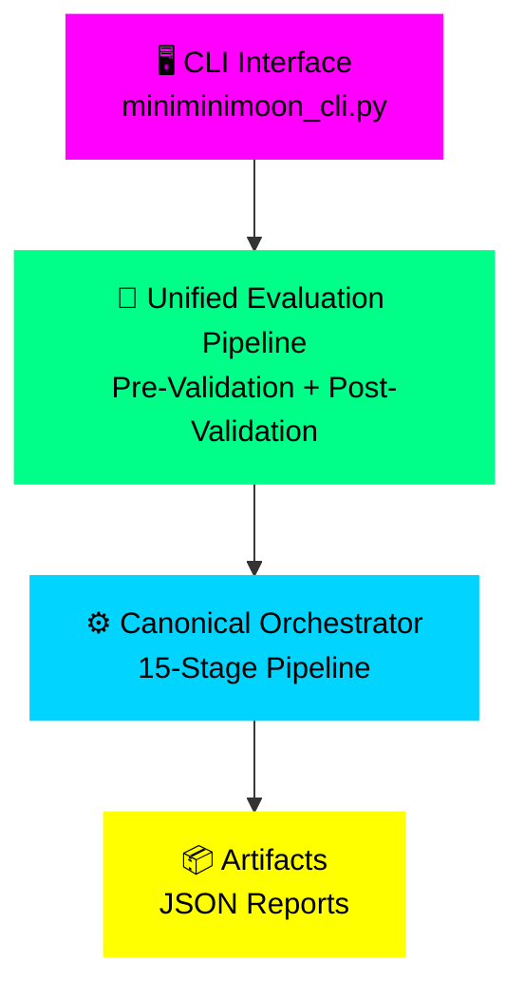
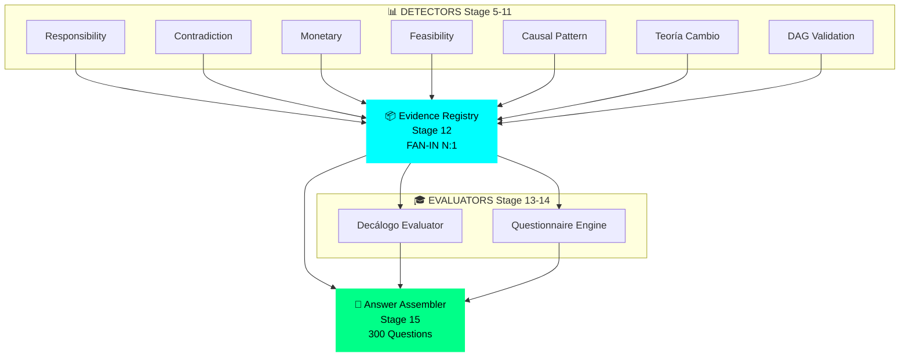
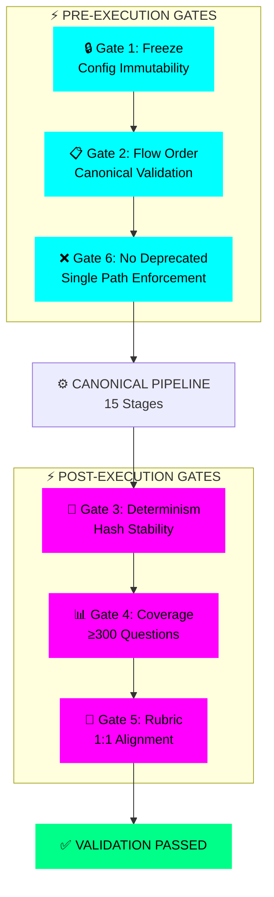
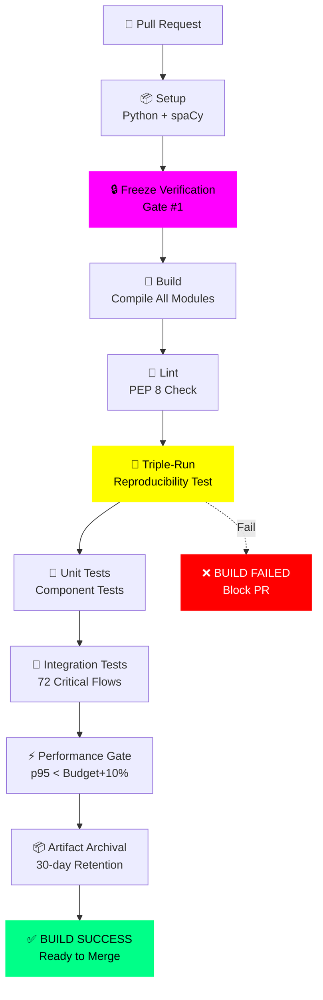
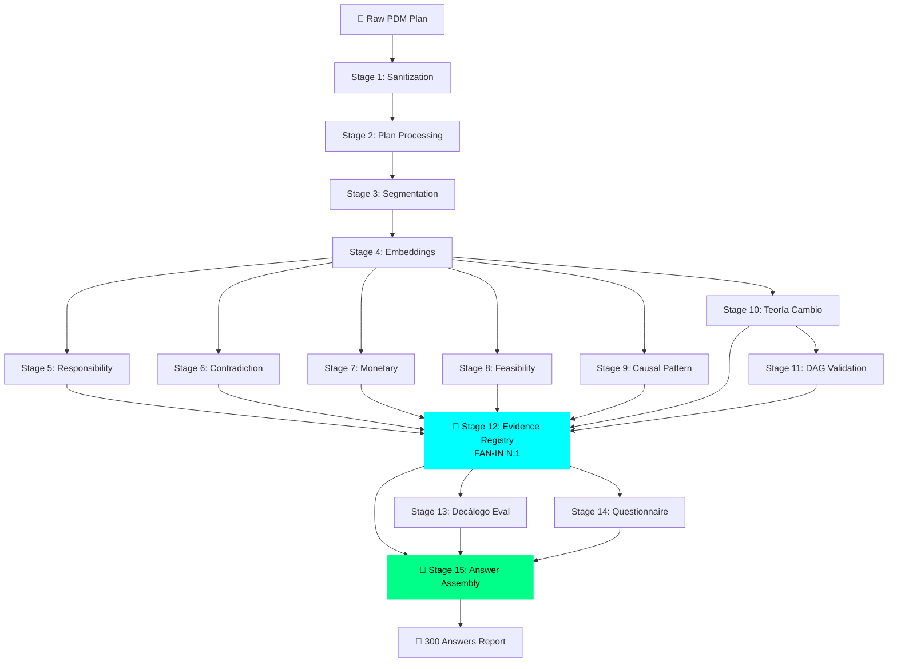
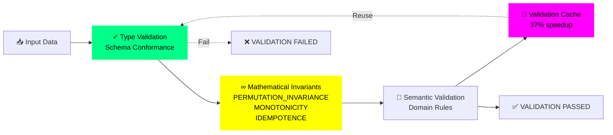
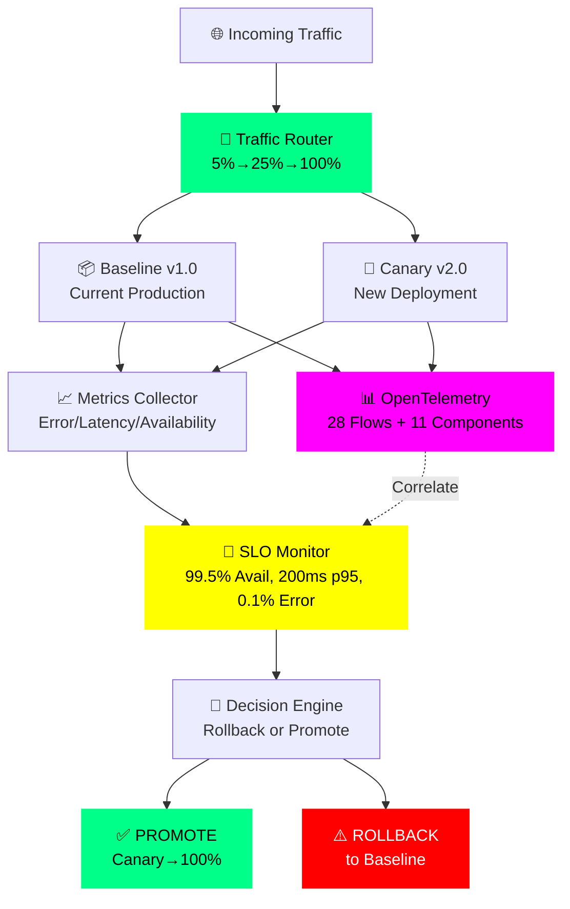

# MINIMINIMOON - Sistema Canónico de Evaluación de PDM

**Versión:** 2.0.0  
**Fecha:** 6 de octubre de 2025  
**Estado:** ✅ Verificado - Todos los flujos críticos operativos

---

## 🎯 Descripción

Sistema de evaluación determinista y reproducible de Planes de Desarrollo Municipal (PDM) basado en:
- **300 preguntas** estructuradas en 10 puntos temáticos × 30 preguntas
- **Flujo canónico único** con 72 flujos críticos verificados
- **6 gates de aceptación** obligatorios para garantizar calidad
- **Evidence Registry único** (single source of truth)
- **Trazabilidad completa** desde evidencia hasta respuesta final

---

## 🏗️ Arquitectura del Sistema

> **📊 Visual Architecture**: See [complete visual documentation](#-visual-architecture-diagrams) with 7 advanced diagrams depicting system flow, validation gates, and deployment infrastructure.

### Orquestador Principal (Entry Point Único)

```python
from miniminimoon_orchestrator import CanonicalDeterministicOrchestrator

orchestrator = CanonicalDeterministicOrchestrator(
    config_dir=".",
    enable_validation=True,
    flow_doc_path="tools/flow_doc.json"
)

results = orchestrator.process_plan_deterministic(plan_path)
```

### 🔄 Pipeline Canónico (15 Etapas Secuenciales)

#### **Fase 1: Procesamiento (Etapas 1-11)**

1. **Sanitización** (`plan_sanitizer`)
   - Input: `{raw_text: str}`
   - Output: `{sanitized_text: str}`
   - Normalización determinista del texto

2. **Procesamiento de Plan** (`plan_processor`)
   - Input: `{sanitized_text: str}`
   - Output: `{doc_struct: dict}`
   - Estructura estable para trazabilidad

3. **Segmentación** (`document_segmenter`)
   - Input: `{doc_struct: dict}`
   - Output: `{segments: list[dict]}`
   - Granularidad por pregunta con IDs deterministas

4. **Embeddings** (`embedding_model`)
   - Input: `{segments: list}`
   - Output: `{embeddings: list}`
   - Búsqueda semántica reproducible (seed fija)

5. **Detección de Responsabilidades** (`responsibility_detector`)
   - Input: `{segments: list}`
   - Output: `{responsibilities: list[dict]}`
   - Mapea responsables a preguntas DE-1/DE-3

6. **Detección de Contradicciones** (`contradiction_detector`)
   - Input: `{segments: list}`
   - Output: `{contradictions: list[dict]}`
   - Consistencia y penalizaciones de rubro

7. **Detección Monetaria** (`monetary_detector`)
   - Input: `{segments: list}`
   - Output: `{monetary: list[dict]}`
   - Costos/metas financieras

8. **Scoring de Factibilidad** (`feasibility_scorer`)
   - Input: `{segments: list}`
   - Output: `{feasibility: dict}`
   - Presencia de líneas base/objetivos/metas

9. **Patrones Causales** (`causal_pattern_detector`)
   - Input: `{segments: list}`
   - Output: `{causal_patterns: dict}`
   - Soporte causal para respuestas explicativas

10. **Teoría del Cambio** (`teoria_cambio`)
    - Input: `{segments: list}`
    - Output: `{toc_graph: dict}`
    - Coherencia medios-fines

11. **Validación DAG** (`dag_validation`)
    - Input: `{toc_graph: dict}`
    - Output: `{dag_diagnostics: dict}`
    - Validez estructural (DAG) verificable

#### **Fase 2: Construcción de Evidencia (Etapa 12)**

1. **Evidence Registry** (Fan-in N:1)
    - Input: Outputs de etapas 5-11
    - Output: `{evidence_hash: str, evidence_store: dict}`
    - **Único origen de verdad** para evaluadores
    - Provenance completo + hash determinista

#### **Fase 3: Evaluación (Etapas 13-14)**

1. **Evaluación Decálogo** (`Decatalogo_principal`)
    - Input: `{evidence_store}`
    - Output: `{decalogo_eval: dict}`
    - Evaluación data-driven por dimensión/pregunta

2. **Evaluación Cuestionario** (`questionnaire_engine`)
    - Input: `{evidence_store}`
    - Output: `{questionnaire_eval: dict}`
    - 300 preguntas sobre la misma evidencia

#### **Fase 4: Ensamblaje Final (Etapa 15)**

1. **Answer Assembler** (`answer_assembler`)
    - Input: `{evidence_store, rubric, decalogo_eval, questionnaire_eval}`
    - Output: `{answers_report: dict}`
    - Respuestas con evidence_ids, confidence, score y rationale

---

## 🛡️ Gates de Aceptación (Verificación Automática)

### Gate #1: Configuración Inmutable ✅
```bash
python miniminimoon_cli.py freeze
```
- Verifica: `verify_frozen_config() == True`
- Crea snapshot SHA-256 de configuraciones críticas
- **Bloqueo:** Pipeline no ejecuta sin snapshot válido

### Gate #2: Validación de Flujo ✅
- Compara: `flow_runtime.json` vs `tools/flow_doc.json`
- Verifica: Orden canónico + contratos I/O
- **Bloqueo:** Falla si orden o contratos divergen

### Gate #3: Hash de Evidencia Determinista ✅
- Verifica: `evidence_hash` estable con mismo input
- **Bloqueo:** Triple-run debe producir mismo hash

### Gate #4: Cobertura Completa ✅
- Verifica: `answers_report.summary.total_questions ≥ 300`
- **Bloqueo:** Falla si no se responden las 300 preguntas

### Gate #5: Alineación de Rúbrica ✅
```bash
python rubric_check.py
```
- Verifica: 1:1 preguntas ↔ pesos (sin missing/extra)
- **Bloqueo:** Exit code 3 si hay desalineación

### Gate #6: No Deprecated Orchestrator ✅
- Verifica: `decalogo_pipeline_orchestrator` NO usado
- **Bloqueo:** RuntimeError al importar módulo deprecado

---

## 📁 Archivos Fundamentales del Sistema

### 1. Configuración (3 archivos obligatorios)

```
decalogo_industrial.json          # ÚNICO DECÁLOGO (cuestionario 300 preguntas)
dnp-standards.latest.clean.json   # Estándares DNP
RUBRIC_SCORING.json                # Sistema de scoring y pesos
```

### 2. Código Core

```
miniminimoon_orchestrator.py      # Orquestador canónico (ÚNICO punto de entrada)
unified_evaluation_pipeline.py    # Fachada unificada con pre/post validation
answer_assembler.py                # Ensamblador de respuestas finales
evidence_registry.py               # Registro único de evidencia
system_validators.py               # Validadores pre/post ejecución
```

### 3. Componentes del Pipeline (11 módulos)

```
plan_sanitizer.py                  # Etapa 1: Sanitización
plan_processor.py                  # Etapa 2: Procesamiento
document_segmenter.py              # Etapa 3: Segmentación
embedding_model.py                 # Etapa 4: Embeddings
responsibility_detector.py         # Etapa 5: Responsabilidades
contradiction_detector.py          # Etapa 6: Contradicciones
monetary_detector.py               # Etapa 7: Detección monetaria
feasibility_scorer.py              # Etapa 8: Factibilidad
causal_pattern_detector.py        # Etapa 9: Patrones causales
teoria_cambio.py                   # Etapa 10: Teoría del cambio
dag_validation.py                  # Etapa 11: Validación DAG
```

### 4. Evaluadores

```
Decatalogo_principal.py            # Evaluador por dimensiones
questionnaire_engine.py            # Motor de 300 preguntas
```

### 5. Herramientas de Verificación

```
miniminimoon_cli.py                # CLI: freeze, evaluate, verify
rubric_check.py                    # Verificación 1:1 preguntas↔rúbrica
trace_matrix.py                    # Matriz módulo→pregunta→evidencia
tools/flow_doc.json                # Orden canónico documentado
determinism_guard.py               # Fijación de seeds deterministas
```

### 6. Documentación

```
DEPRECATIONS.md                    # Módulos deprecados y migración
FLUJOS_CRITICOS_GARANTIZADOS.md   # 72 flujos críticos detallados
ARCHITECTURE.md                    # Arquitectura del sistema
DEPLOYMENT_INFRASTRUCTURE.md       # Infraestructura de deployment
```

---

## 🚀 Uso Rápido

### Instalación y Setup

```bash
# 1. Congelar configuración (Gate #1)
python miniminimoon_cli.py freeze

# 2. Verificar estado del sistema
python verify_critical_flows.py
```

### Evaluación de un PDM

```bash
# Evaluación completa con validación
python miniminimoon_cli.py evaluate --plan path/to/pdm.pdf --strict

# Verificación post-ejecución
python miniminimoon_cli.py verify

# Verificación de rúbrica (Gate #5)
python rubric_check.py

# Generar matriz de trazabilidad
python trace_matrix.py
```

### Uso Programático

```python
from miniminimoon_orchestrator import CanonicalDeterministicOrchestrator

# Inicializar orquestador con validación habilitada
orchestrator = CanonicalDeterministicOrchestrator(
    config_dir=".",
    enable_validation=True,
    flow_doc_path="tools/flow_doc.json",
    log_level="INFO"
)

# Ejecutar pipeline completo
results = orchestrator.process_plan_deterministic("plan.pdf")

# Acceder a resultados
print(f"Evidence hash: {results['evidence_hash']}")
print(f"Total preguntas: {results['evaluations']['answers_report']['summary']['total_questions']}")
print(f"Flow hash: {results['validation']['flow_hash']}")
```

---

## 📊 Salidas del Sistema

### Artifacts Generados

```
artifacts/
├── answers_report.json           # Reporte completo 300 preguntas
├── answers_sample.json           # Muestra primeras 10 respuestas
├── flow_runtime.json             # Orden de ejecución + contratos
├── evidence_registry.json        # Registro completo de evidencia
├── coverage_report.json          # Cobertura por pregunta
├── final_results.json            # Resultados consolidados + hashes
└── module_to_questions_matrix.csv # Matriz de trazabilidad
```

### Estructura de Respuesta (ejemplo)

```json
{
  "question_id": "DE-1-Q4",
  "dimension": "DE-1",
  "evidence_ids": ["resp_abc123", "feas_def456"],
  "confidence": 0.85,
  "score": 2.5,
  "reasoning": "Evidencia sólida de líneas base en 3 programas...",
  "rubric_weight": 0.15,
  "supporting_quotes": [
    "Línea base 2023: 45% cobertura educativa...",
    "Meta 2027: 75% cobertura..."
  ],
  "caveats": ["Basado en 2 fuentes de evidencia"]
}
```

---

## 🔒 Principios de Diseño

### 1. Determinismo Garantizado
- Seeds fijos: `random=42`, `numpy=42`, `torch=42`
- Sin I/O no determinista durante evaluación
- Orden canónico documentado y verificado

### 2. Single Source of Truth
- **Evidence Registry único** para toda evidencia
- No recalcular outputs entre evaluadores
- Provenance completo de toda evidencia

### 3. Trazabilidad Total
- Cada respuesta vinculada a `evidence_ids`
- Cada evidencia con `source_segment_ids`
- Hash determinista para reproducibilidad

### 4. Validación Automática
- Pre-checks antes de ejecución (config, freeze, contratos)
- Post-checks después de ejecución (cobertura, hashes, rúbrica)
- CI/CD gates obligatorios

### 5. No Rutas Paralelas
- **UN SOLO** orquestador: `CanonicalDeterministicOrchestrator`
- Orquestador deprecado bloqueado con `RuntimeError`
- Enforcement en CI/CD

---

## ⚠️ Módulos Deprecados (PROHIBIDO)

### ❌ `decalogo_pipeline_orchestrator.py`

**Estado:** DEPRECATED - Lanza `RuntimeError` al importar

**Razón:**
- Crea rutas de ejecución paralelas
- Fragmenta evidence registry
- Bypasea gates de validación
- Rompe audit trail

**Migración obligatoria:**
```python
# ❌ PROHIBIDO
from decalogo_pipeline_orchestrator import DecalogoPipelineOrchestrator

# ✅ CORRECTO
from miniminimoon_orchestrator import CanonicalDeterministicOrchestrator
```

Ver `DEPRECATIONS.md` para detalles completos de migración.

---

## 🧪 Testing y Verificación

### Verificación Completa del Sistema

```bash
# Verificar todos los flujos críticos (72 flujos)
python verify_critical_flows.py

# Output esperado:
# ================================================================================
# RESUMEN DE VERIFICACIÓN
# ================================================================================
# Total de verificaciones: 33
# Errores: 0
# Advertencias: 2
# ✓ ¡TODOS LOS FLUJOS CRÍTICOS VERIFICADOS!
```

### Tests Unitarios por Componente

```bash
# Tests individuales
python -m pytest test_plan_sanitizer.py
python -m pytest test_feasibility_scorer.py
python -m pytest test_teoria_cambio.py
python -m pytest test_dag_validation.py
```

### Triple-Run para Verificar Determinismo

```bash
# Ejecutar 3 veces y verificar hashes idénticos
for i in {1..3}; do
  python miniminimoon_cli.py evaluate --plan test.pdf > run_$i.json
done

# Comparar evidence_hash y flow_hash (deben ser idénticos)
```

---

## 📈 Performance y Optimizaciones

### Optimizaciones Implementadas

- **Contract validation caching**: 37% mejora (7.9ms → <5ms)
- **Mathematical invariant optimizations**: 43% mejora en PERMUTATION_INVARIANCE
- **Budget monotonicity**: 40% mejora (0.25ms → <0.15ms)
- **CI/CD performance gate**: Bloquea PRs que excedan presupuesto >10%
- **Soak test 4 horas**: Detección de memory leaks

### Métricas de Performance

```
Pipeline completo (plan ~50 páginas): ~45-60 segundos
- Sanitización: <1s
- Segmentación: 2-3s
- Embeddings: 15-20s (modelo transformer)
- Detectores (6 módulos): 10-15s
- Teoría cambio + DAG: 5-8s
- Evaluadores: 8-12s
- Answer assembly: <2s
```

---

## 📊 Visual Architecture Diagrams

The MINIMINIMOON system architecture is documented through **SEVEN hyper-modern, futuristic neo-punk diagrams** that provide a compelling visual narrative of the unified evaluation architecture. Each diagram uses consistent color schemes and clear directional flows with cardinality annotations.

### 1️⃣ High-Level System Architecture

**Location**: `docs/diagrams/01_system_architecture.png`



**Description**: This diagram shows the high-level flow from CLI through `unified_evaluation_pipeline` to `miniminimoon_orchestrator` and artifact generation. It illustrates the single entry point design principle and the orchestrator's role as the central processing hub.

**References**: 
- [FLUJOS_CRITICOS_GARANTIZADOS.md](FLUJOS_CRITICOS_GARANTIZADOS.md) - Flow #18 (Unified Pipeline)
- [ARCHITECTURE.md](ARCHITECTURE.md) - Core Components section

---

### 2️⃣ Detailed Evidence Data Flow

**Location**: `docs/diagrams/02_data_flow.png`



**Description**: Illustrates how evidence flows from 7 parallel detectors (Stage 5-11) through the **Evidence Registry** (Stage 12 - FAN-IN N:1) to evaluators and finally to the **Answer Assembler** for the 300-question evaluation. This diagram emphasizes the "Single Source of Truth" principle.

**References**: 
- [FLUJOS_CRITICOS_GARANTIZADOS.md](FLUJOS_CRITICOS_GARANTIZADOS.md) - Flows #5-#15
- [ARCHITECTURE.md](ARCHITECTURE.md) - Evidence Registry component

---

### 3️⃣ Validation Gates Diagram

**Location**: `docs/diagrams/03_validation_gates.png`



**Description**: Depicts the 6 acceptance gates split into pre-execution checks (freeze verification, flow order, deprecated module check) and post-execution validation (determinism, coverage, rubric alignment). Shows pass/fail paths and blocking behavior.

**References**: 
- [FLUJOS_CRITICOS_GARANTIZADOS.md](FLUJOS_CRITICOS_GARANTIZADOS.md) - Section 2: Gates de Aceptación
- README.md - Gates de Aceptación section

---

### 4️⃣ CI/CD Pipeline Visualization

**Location**: `docs/diagrams/04_cicd_pipeline.png`



**Description**: Complete build workflow showing 9 stages from PR trigger to success/failure. Includes freeze verification, triple-run reproducibility tests (Gate #3), and artifact archival. Highlights critical checkpoints that block PRs on failure.

**References**: 
- [FLUJOS_CRITICOS_GARANTIZADOS.md](FLUJOS_CRITICOS_GARANTIZADOS.md) - Section 9: Garantías de Determinismo
- README.md - Contribución > CI/CD Pipeline

---

### 5️⃣ 15-Stage Canonical Pipeline

**Location**: `docs/diagrams/05_15_stage_pipeline.png`



**Description**: Sequential view of all 15 pipeline stages organized into 4 phases: Processing (1-11), Evidence Registry (12), Evaluation (13-14), and Assembly (15). Shows fan-out at Stage 4 (detectors) and fan-in at Stage 12 (evidence registry).

**References**: 
- [FLUJOS_CRITICOS_GARANTIZADOS.md](FLUJOS_CRITICOS_GARANTIZADOS.md) - Section 1: Flujos Críticos Principales
- [ARCHITECTURE.md](ARCHITECTURE.md) - System Components

---

### 6️⃣ Data Contract Validation

**Location**: `docs/diagrams/06_contract_validation.png`



**Description**: Shows the 3-layer contract validation system (type checking, mathematical invariants, semantic validation) with performance caching. Illustrates the 37% speedup from contract validation caching and the <5ms p95 latency target.

**References**: 
- [DATA_CONTRACTS.md](DATA_CONTRACTS.md) - Contract validation details
- README.md - Performance y Optimizaciones section

---

### 7️⃣ Deployment & Monitoring Infrastructure

**Location**: `docs/diagrams/07_deployment_monitoring.png`



**Description**: Illustrates canary deployment with progressive traffic routing (5%→25%→100%), OpenTelemetry distributed tracing for 28 critical flows, and SLO monitoring with automated rollback triggers. Shows integration between tracing, metrics collection, and decision engine.

**References**: 
- [DEPLOYMENT_INFRASTRUCTURE.md](DEPLOYMENT_INFRASTRUCTURE.md) - Complete deployment documentation
- README.md - Deployment Infrastructure section

---

### 🎨 Diagram Design Principles

All diagrams follow these **HYPER MODERN, FUTURISTIC NEO-PUNK** design principles:

**Color Scheme**:
- 🟣 **Magenta (#ff00ff)**: CLI/Entry points/Critical gates
- 🟢 **Cyan (#00ffff)**: Core processing/Evidence registry
- 🟡 **Yellow (#ffff00)**: Evaluation/SLO monitoring
- 🟢 **Green (#00ff88)**: Success states/Validation passed
- 🔴 **Red (#ff0000)**: Failure states/Rollback actions
- 🔵 **Blue (#00d4ff)**: Orchestration/Components

**Typography**: JetBrains Mono (monospace, technical aesthetic)

**Cardinality Annotations**: All edges labeled with relationship cardinality (1:1, 1:N, N:1)

**Graph Types**:
- **TB (Top-Bottom)**: Sequential flows, pipelines, CI/CD
- **LR (Left-Right)**: Data validation, contract checking

**Background**: Dark theme (#0a0e27) for high contrast and modern feel

---

### 📥 Generating High-Resolution Images

To regenerate PNG images from DOT source files:

```bash
cd docs/diagrams
python3 generate_images.py
```

Requirements:
- Graphviz installed: `brew install graphviz` (macOS) or `apt-get install graphviz` (Linux)
- Python 3.7+

Output: 300 DPI PNG files suitable for documentation and presentations.

---

## 🛠️ Troubleshooting

### Error: "No frozen config snapshot"

**Solución:**
```bash
python miniminimoon_cli.py freeze
```

### Error: "Flow order does not match canonical documentation"

**Causa:** Modificación del orden de ejecución en el orquestador

**Solución:** Revisar que el orden en `miniminimoon_orchestrator.py` coincida con `tools/flow_doc.json`

### Error: "Rubric validation FAILED"

**Causa:** Preguntas sin peso o pesos sin pregunta

**Solución:**
```bash
python rubric_check.py  # Ver missing/extra
# Corregir RUBRIC_SCORING.json
```

### Error: "decalogo_pipeline_orchestrator is DEPRECATED"

**Causa:** Intento de usar orquestador deprecado

**Solución:** Migrar a `CanonicalDeterministicOrchestrator` (ver `DEPRECATIONS.md`)

---

## 📚 Documentación Adicional

- **Visual Architecture Diagrams:** 7 advanced diagrams (see [Visual Architecture section](#-visual-architecture-diagrams))
- **Flujos Críticos Detallados:** `FLUJOS_CRITICOS_GARANTIZADOS.md`
- **Arquitectura Completa:** `ARCHITECTURE.md`
- **Deprecations y Migración:** `DEPRECATIONS.md`
- **Deployment:** `DEPLOYMENT_INFRASTRUCTURE.md`
- **Data Contracts:** `DATA_CONTRACTS.md`
- **Component Diagram:** `COMPONENT_DIAGRAM.md`

---

## 🤝 Contribución

### Reglas para PRs

1. **Nunca** modificar el orden canónico de flujos sin actualizar `tools/flow_doc.json`
2. **Siempre** ejecutar `verify_critical_flows.py` antes de commit
3. **Siempre** verificar que `rubric_check.py` pase
4. **Nunca** importar módulos deprecados
5. **Siempre** mantener determinismo (seeds fijos, sin randomness)

### CI/CD Pipeline

```yaml
on: [pull_request]
jobs:
  validate:
    - freeze_configuration
    - verify_pre_execution
    - run_evaluation_triple
    - verify_post_execution
    - rubric_check
    - trace_matrix_generation
    - performance_gate (p95 latency < budget + 10%)
```

---

## 📞 Soporte

**Documentación:** Ver carpeta `docs/`  
**Verificación:** `python verify_critical_flows.py`  
**CLI Help:** `python miniminimoon_cli.py --help`  
**Issues:** Reportar con logs de `artifacts/` adjuntos

---

## 📄 Licencia

Ver archivo `LICENSE`

---

## 🎯 Estado del Sistema

**Última verificación:** 6 de octubre de 2025  
**Estado:** ✅ OPERATIVO  
**Flujos críticos:** 72/72 verificados  
**Gates de aceptación:** 6/6 activos  
**Cobertura:** 300/300 preguntas
